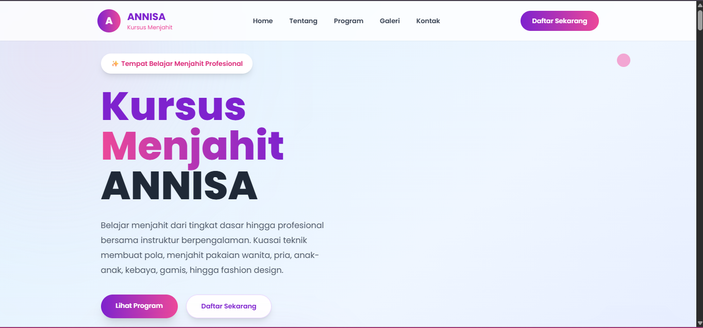

# 🎀 Kursus Menjahit ANNISA

## 📖 Deskripsi

Website Kursus Menjahit ANNISA merupakan website portofolio yang dibuat menggunakan Laravel 11 dan Tailwind CSS.

Website ini menampilkan informasi mengenai:

- Home
- Tentang
- Program Kursus
- Galeri
- Kontak

Website telah dimodifikasi dengan tema warna ungu, pink, dan biru sehingga memiliki tampilan yang berbeda dari tutorial dosen.

## 📸 Screenshot Website

## 🚀 Teknologi yang Digunakan

- Laravel 11
- Tailwind CSS
- Vite
- PHP
- HTML
- CSS

---

## 👩‍💻 Dibuat Oleh

Nama : Annisa Kiting

Universitas : (Isi nama kampusmu)

Jurusan : (Isi jurusanmu)

Mata Kuliah : Pemrograman Web
